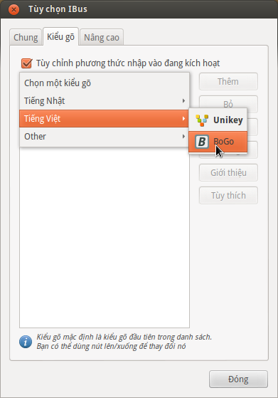
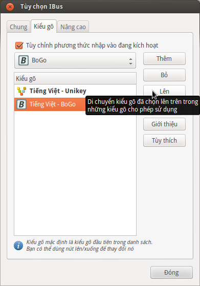

Cài đặt
=======

ibus-bogo có thể được cài đặt từ gói cài đặt hoặc (nếu bạn muốn) trực
tiếp từ mã nguồn.

Từ gói cài đặt cho các bản phân phối Linux thông dụng
-----------------------------------------------------

Đây là cách đơn giản nhất.

Với các HĐH thuộc dòng Debian/Ubuntu thì bạn có thể cài đặt tự động bằng
cách chạy lệnh sau::

    wget -O - http://bogoengine.github.com/debian/stable/installer.sh | sudo sh

Hoặc nếu bạn luôn muốn dùng phiên bản đang phát triển, cập nhật liên tục,
có thể nhiều lỗi thì sử dụng lệnh sau::

    wget -O - http://bogoengine.github.com/debian/unstable/installer.sh | sudo sh

(nội dung script là thêm repo của nhóm phát triển, sau đó cài đặt gói
``ibus-bogo``)

Người dùng Archlinux có thể cài từ `gói AUR stable`_ hoặc `develop`_ do bạn `Ngô Huy`_ cung cấp.

Fan của Fedora có thể cài gói RPM từ `RPM repo`_ của anh `Trương Anh Tuấn`_.

**NOTE** Nếu bạn muốn đóng gói BoGo cho các bản phân phối khác thì đừng
ngần ngại thông báo với chúng tôi để trang hướng dẫn này được cập nhật
liên tục cho các bản phân phối mới nhất. :D

.. _file deb: https://bogoengine.github.com/debian/stable/pool/universe/i/ibus-bogo
.. _gói AUR stable: https://aur.archlinux.org/packages/ibus-bogo/
.. _develop: https://aur.archlinux.org/packages/ibus-bogo-git/
.. _RPM repo: http://tuanta.fedorapeople.org/ibus-bogo/
.. _Ngô Huy: https://github.com/NgoHuy
.. _Trương Anh Tuấn: https://github.com/tuanta

Từ mã nguồn
-----------

ibus-bogo có sử dụng các thành phần sau, hãy chắc
chắn rằng các thành phần này đã được cài trên máy nếu bạn cần cài đặt
từ mã nguồn (theo tên gói cài đặt của Debian/Ubuntu):

* ibus 1.4.x
* python 3.2+
* python-gi (pygobject)
* cmake
* qt4-linguist-tools
* pyqt4-dev-tools
* python3-pyqt4
* gir1.2-ibus-1.0 (GObject Introspection data)
* gir1.2-wnck-3.0

Lệnh sau sẽ cài đặt tất cả các gói cần thiết::

    sudo apt-get install python3 ibus cmake python3-gi pyqt4-dev-tools \
    gir1.2-ibus-1.0 gir1.2-wnck-3.0 python3-pyqt4 qt4-linguist-tools

Tải mã nguồn tại https://github.com/BoGoEngine/ibus-bogo-python/tags rồi giải nén
hoặc dùng::

    git clone https://github.com/BoGoEngine/ibus-bogo-python.git

Nếu bạn dùng git clone thì chạy thêm lệnh ``git submodule init && git submodule update``
trong thư mục mã nguồn.

Chạy lệnh sau để cài đặt::

    mkdir build && cd build
    cmake .. && make install

Gỡ cài đặt::

    cd build && sudo make uninstall

Cấu hình sau khi cài đặt
------------------------

Sau khi cài đặt thì bạn cần phải thiết lập IBus để sử dụng ibus-bogo.
Trước hết bạn cần mở mục Settings của IBus bằng cách nhấn vào icon trên
system tray, chọn **Preferences** (*Tùy thích*) hoặc chạy lệnh
``ibus-setup`` (ảnh minh họa trên giao diện Unity của Ubuntu):

.. image:: _static/img/menu.png
   :align: center

Sau đó vào tab
**Input Method** (*Kiểu gõ*), ấn vào menu **Select an input method**
(*Chọn một kiểu gõ*), di chuyển đến dòng **Vietnamese** (*Tiếng Việt*),
chọn BoGo:

Nếu bạn muốn có thể dùng nút **Up** (*Lên*) bên phải để đặt
ibus-bogo làm bộ gõ mặc định:

Với Ubuntu 13.10, trước hết bạn logout/login hoặc chạy lệnh ``ibus-daemon -xdr``
để khởi động lại IBus. Sau đó bạn sử dụng mục Text Entry trong Settings để thêm
BoGo như video dưới đây:

.. raw:: html

    <iframe style="margin-left:auto;margin-right:auto;display:block;" width="640" height="480" src="//www.youtube.com/embed/39OfkV-aEpo" frameborder="0" allowfullscreen></iframe>

Để đảm bảo chương trình vận hành như ý muốn. Thêm các dòng sau vào
file ~/.profile sau đó logout và login::

    export GTK_IM_MODULE=ibus
    export XMODIFIERS=@im=ibus
    export QT4_IM_MODULE=xim
    export QT_IM_MODULE=xim
