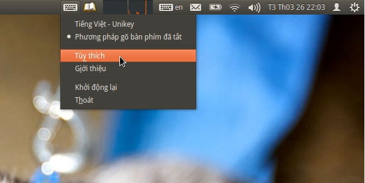

Cài đặt
=======

ibus-bogo có thể được cài đặt từ gói cài đặt hoặc (nếu bạn muốn) trực
tiếp từ mã nguồn.

Từ gói cài đặt cho các bản phân phối Linux thông dụng
-----------------------------------------------------

Người dùng Archlinux có thể cài từ `gói AUR stable`_ hoặc `develop`_ do bạn `Ngô Huy`_ cung cấp.

Người dùng Fedora có thể cài gói RPM từ `RPM repo`_ của anh `Trương Anh Tuấn`_.

.. note::

   Nếu bạn muốn đóng gói BoGo cho các bản phân phối khác thì đừng
   ngần ngại thông báo với chúng tôi để trang hướng dẫn này được cập nhật
   liên tục cho các bản phân phối mới nhất. :D

.. _gói AUR stable: https://aur.archlinux.org/packages/ibus-bogo/
.. _develop: https://aur.archlinux.org/packages/ibus-bogo-git/
.. _RPM repo: http://tuanta.fedorapeople.org/ibus-bogo/
.. _Ngô Huy: https://github.com/NgoHuy
.. _Trương Anh Tuấn: https://github.com/tuanta

Từ mã nguồn
-----------

.. warning::

   Nếu bạn chưa thành thạo Linux và chỉ muốn sử dụng BoGo thì không nên
   cài đặt từ mã nguồn.

ibus-bogo có sử dụng các phần mềm sau, hãy chắc chắn rằng chúng đã được
cài trên máy (theo tên gói cài đặt của Debian/Ubuntu):

* ibus 1.4.x
* python 3.2+
* python3-gi (pygobject)
* python3-entrant (kiểm tra chính tả)
* cmake
* qt4-linguist-tools
* pyqt4-dev-tools
* python3-pyside
* gir1.2-ibus-1.0 (GObject Introspection data)
* gir1.2-wnck-3.0

Lệnh sau sẽ cài đặt tất cả các gói cần thiết::

    sudo apt-get install python3 ibus cmake python3-gi pyqt4-dev-tools \
    gir1.2-ibus-1.0 gir1.2-wnck-3.0 python3-pyqt4 qt4-linguist-tools \
    python3-enchant

.. note::

   Từ bản 0.4 thì ibus-bogo sử dụng PyQt4 thay vì PySide.

Sau đó bạn tải mã nguồn tại https://github.com/BoGoEngine/ibus-bogo-python/releases
rồi giải nén. Hoặc dùng::

    git clone https://github.com/BoGoEngine/ibus-bogo.git

Nếu bạn tải từ trang releases, bạn cần khởi tạo CMake:

    cmake CMakeLists.txt

Chạy lệnh sau để cài đặt::

    sudo make install

Gỡ cài đặt::

    sudo make uninstall

Cấu hình sau khi cài đặt
------------------------

Sau khi cài đặt thì bạn cần phải thiết lập IBus để sử dụng ibus-bogo.
Trước hết bạn cần mở mục Settings của IBus bằng cách nhấn vào icon trên
system tray, chọn **Preferences** (*Tùy thích*) hoặc chạy lệnh
``ibus-setup`` (ảnh minh họa trên giao diện Unity của Ubuntu):

Sau đó vào tab
**Input Method** (*Kiểu gõ*), ấn vào menu **Select an input method**
(*Chọn một kiểu gõ*), di chuyển đến dòng **Vietnamese** (*Tiếng Việt*),
chọn BoGo:

Nếu bạn muốn có thể dùng nút **Up** (*Lên*) bên phải để đặt
ibus-bogo làm bộ gõ mặc định:

.. image:: _static/img/set_default.png
   :align: center

Với Ubuntu 13.10, trước hết bạn logout/login hoặc chạy lệnh ``ibus-daemon -xdr``
để khởi động lại IBus. Sau đó bạn sử dụng mục Text Entry trong Settings để thêm
BoGo như video dưới đây:

.. raw:: html

    <iframe style="margin-left:auto;margin-right:auto;display:block;margin-bottom:24px" width="640" height="480" src="//www.youtube.com/embed/39OfkV-aEpo" frameborder="0" allowfullscreen></iframe>

.. note::

   Nếu không gõ tiếng Việt được trong Skype hay các chương trình viết bằng Qt,
   bạn thêm các dòng sau vào file ``~/.profile`` sau đó logout và login::

       export GTK_IM_MODULE=ibus
       export QT4_IM_MODULE=xim
       export QT_IM_MODULE=xim
       export XMODIFIERS=@im=ibus
