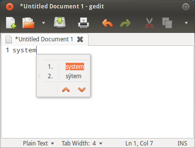

Sử dụng
=======

Gõ tiếng Việt
-------------
ibus-bogo hoạt động giống các bộ gõ khác dành cho IBus. Bạn chỉ cần đặt
con trỏ vào những chỗ cần gõ, nhấn phím tắt của IBus (thường là
``control - cách``, hoặc phím tắt tùy chọn của bạn) và gõ tiếng Việt bình
thường.

Thay đổi kiểu gõ, bảng mã
-------------------------

Mặc định, ibus-bogo sử dụng kiểu gõ TELEX và bảng mã UTF-8 cho Unicode.
Nếu những thiết lập này không phù hợp với bạn thì có thể thay đổi sử
dụng công cụ thiết lập đi kèm với ibus-bogo.

Để mở công cụ này thì bạn có thể tìm kiếm từ **ibus-bogo** trong mục tìm
kiếm phần mềm (Dash Launcher, GNOME Do...) hoặc tìm trong menu
**Applications/Utility**. Hoặc nếu ibus-bogo đang chạy thì bạn có thể
nhấn nút **Preferences** hình hộp dụng cụ trên menu của IBus.

Sau đó chương trình sẽ hiện ra với giao diện như sau:

Gõ lẫn tiếng Anh trong văn bản tiếng Việt
-----------------------------------------

ibus-bogo đi kèm tính năng nhận dạng từ không đúng chính tả tiếng Việt
(chẳng hạn như thuật ngữ tiếng Anh) và tự động chuyển từ đang gõ dở
thành tập hợp phím đã gõ và đưa ra phương án cố gắng coi từ đang gõ là
tiếng Việt cho người dùng:

**CHÚ Ý:**
Với phiên bản 0.3 thì tính năng này có thể mất
thời gian làm quen với một số người sử dụng và chưa thực sự ổn định, sẽ
hiển thị password nếu bạn gõ trong Terminal nên đã được tắt mặc định.
Tuy nhiên, bạn có thể bật/tắt lựa chọn **Tự động trả về tiếng Anh**
trong tab **Chính tả** của phần mềm thiết lập.

Chuyển đổi bảng mã trong clipboard
----------------------------------

Từ bản 0.3 thì ibus-bogo đã có thể chuyển đổi văn bản trong clipboard từ
các bảng mã cũ như TCVN3, VNI sang Unicode (dạng UTF-8).

Bạn cần copy một đoạn văn bản, chọn bảng mã nguồn và nhấn nút
**Chuyển đổi**, sau đó dán trở lại chỗ cũ.

Tính năng này có một số hạn chế hiện tại như chỉ hỗ trợ bảng mã nguồn là
TCVN3 và VNI, chỉ hỗ trợ bảng mã đích là UTF-8. Hiện tại cũng chưa đủ
thông minh để phân tích dữ liệu XML trong clipboard của LibreOffice. Mọi
ý kiến đóng góp luôn được hoan nghênh.
